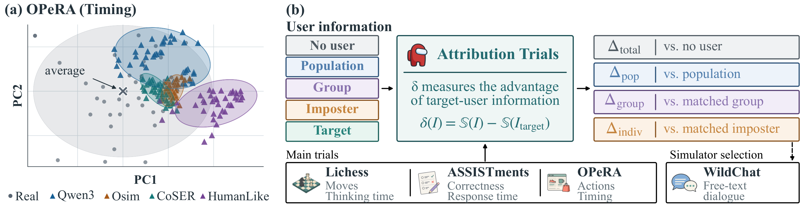

# Is There an Imposter Among Us? Auditing User Simulators with Attribution Trials

Code for **Attribution Trials (AT)**, a controlled audit that tests whether a user simulator represents
the individual it is given, rather than behavior shared by many users.



**Does a user simulator preserve individual fidelity?**
(a) Waiting times of 41 OPeRA shoppers before their next action, real and predicted by four simulators
given each user's own information, projected onto the real users' first two principal components.
(b) AT compares the target user's information with four controls, and a simulator passes only when all
four gains are significant; WildChat is the simulator-selection study.

## Abstract

User simulators are commonly evaluated by their ability to steer toward the target user's behavior, given
the user's profile or history.
However, this similarity does not show whether the simulator captures what makes that individual unique,
rather than behavior shared by many users.
In interactive systems, this can lead to inaccurate simulations of users and thus, unreliable results.
We identify this as the simulators' lack of *individual fidelity* – the ability to capture behavior unique
to the intended user.
We therefore develop Attribution Trials (AT), a controlled audit for testing whether a simulator represents
that individual rather than merely responding to patterns shared across users.
AT compares the target user's information (the treatment) with four controls: no user information, generic
population information, matched-group information, and a matched imposter's information.
We apply AT to next-action prediction on real user trajectories, for a variety of simulators on three
datasets: chess playing, knowledge tracing, and online shopping.
Across 84 combinations of simulators, datasets, and predicted behaviors, none shows individual fidelity.
Existing user simulation benchmarks barely change their scores when an imposter's information replaces the
target user's.
Finally, AT can guide simulator selection: on WildChat, simulators with larger AT gains tend to generate
text that moves closer to the user's real turn when given the target user's profile instead of an
imposter's.
Together, these findings show that apparent behavioral similarity can hide limited individual fidelity, and
that AT can help choose the simulators that come closest to it.

## Quick start

### 1. Install

With [uv](https://docs.astral.sh/uv/). `uv.toml` restricts uv to its own managed Python builds, so the
system Python is never used:

```bash
git clone https://github.com/jamesnulliu/Is-There-an-Imposter-Among-Us-Auditing-User-Simulators-with-Attribution-Trials.git
cd Is-There-an-Imposter-Among-Us-Auditing-User-Simulators-with-Attribution-Trials
uv sync --extra all
uv run python -m attribution_trials.cli --version
```

With pip (Python 3.10 or newer):

```bash
python -m venv .venv && source .venv/bin/activate
pip install -e ".[all]"
```

Extras: `gpu` (PyTorch, Transformers, PEFT, Accelerate for training and scoring), `chess` (Lichess
ingest), `api` (OpenAI-compatible calls), `wandb` (optional tracking), `dev` (ruff).
Choose a subset with `uv sync --extra gpu --extra chess` or `pip install -e ".[gpu,chess]"`.
If the default PyTorch wheel does not match your accelerator, install the matching PyTorch build first.

### 2. Configure

| Variable | Default | Content |
|---|---|---|
| `AT_DATA` | `data/` | raw and prepared datasets |
| `AT_MODELS` | `models/` | local model checkpoints |
| `AT_RESULTS` | `results/` | every output: `audit/`, `analysis/`, `comparison/`, `wildchat/`, `validation/`, `figures/`, `tables/` |
| `OPENAI_API_KEY`, `OPENAI_BASE_URL` | | API models, the known-signal controls and the LLM judge |
| `HF_TOKEN` | | gated Hugging Face downloads |
| `WANDB_API_KEY` | | optional; tracking is skipped without it |

### 3. Get the data

```bash
bash scripts/data/lichess.sh                        # chess: three Lichess blitz cohorts
# knowledge tracing: put ASSISTments 2009 skill_builder_data_corrected.csv in $AT_DATA/kt/raw/
python -m attribution_trials.data.prepare_kt
bash scripts/download/wildchat.sh                   # WildChat-1M at a pinned revision
bash scripts/download/released_simulators.sh        # CoSER-8B, HumanLike-7B
bash scripts/download/wildchat_models.sh            # WildChat simulators and the MiniLM encoder
```

OPeRA, PersonaMem and HorizonBench are downloaded at pinned revisions on first use.

### 4. Run a first experiment (CPU, no data)

The synthetic-population checks need neither datasets nor GPUs:

```bash
python -m attribution_trials.validation.lambda_sweep       # known individual signal, varying strength
python -m attribution_trials.validation.reference_nulls    # weaker controls vs the matched imposter
```

### 5. Run the experiments

Every step is a module (`python -m attribution_trials.<stage>.<module>`, or `uv run python -m ...`) or a
shell driver in `scripts/`. Outputs land under `$AT_RESULTS`. Run the stages in this order:

| Stage | Entry points | Paper |
|---|---|---|
| Audit | `scripts/audit/*.sh` | Section 4 |
| Gains and significance | `attribution_trials.analysis.*` | Section 5.1, Appendices A–C |
| Existing benchmarks and per-user baselines | `scripts/comparison/*.sh` | Section 5.2, Appendices C–D |
| Simulator selection on WildChat | `attribution_trials.wildchat.*`, `scripts/wildchat/*.sh` | Section 5.3, Appendix E |
| Validation and ablations | `attribution_trials.validation.*`, `scripts/validation/dose.sh` | Section 6, Appendix F |
| Figures and tables | `attribution_trials.figures.*`, `attribution_trials.tables.*` | |

The full command sequence is below. GPU steps need a CUDA GPU; the 30–32B models need about 80 GB of GPU
memory. The figures use the Times New Roman font.

## Reproducing the paper

### Audit: per-user scores under the five conditions (Section 4)

```bash
bash scripts/audit/latent_families.sh             # static embedding, recurrent embedding, structured memory
bash scripts/audit/lora_matrix.sh [n_gpus]        # user-profile LoRA, chess and KT
bash scripts/audit/frozen_panel.sh                # frozen prompt, chess and KT
bash scripts/audit/run_opera_jobs.sh [n_gpus]     # user-profile LoRA and frozen prompt, OPeRA
bash scripts/audit/released_panel.sh              # CoSER-8B, HumanLike-7B
bash scripts/audit/osim_panel.sh                  # Osim-4B/8B, with and without midtraining
bash scripts/audit/api_panel.sh                   # GPT-4.1, GPT-4.1-mini, DeepSeek-V3.2
```

### Gains, significance and the main results (Section 5.1, Appendices A–C)

```bash
python -m attribution_trials.analysis.identity
python -m attribution_trials.analysis.gains
python -m attribution_trials.analysis.master_ladder
python -m attribution_trials.analysis.seed_inference
python -m attribution_trials.analysis.api_rows
python -m attribution_trials.figures.attribution_map
python -m attribution_trials.tables.combinations
python -m attribution_trials.tables.master_ladder
python -m attribution_trials.tables.seed_inference
```

`analysis.shares` and `tables.main_results` read outputs of the next two stages and run after them.

### Existing benchmarks and per-user baselines (Section 5.2, Appendices C–D)

```bash
bash scripts/comparison/per_option_frozen.sh
bash scripts/comparison/per_option_olmo.sh
bash scripts/comparison/per_option_released.sh
bash scripts/comparison/per_option_cross.sh
bash scripts/comparison/coverage_inputs.sh       # per-option rescoring for the population-realism row
bash scripts/comparison/cpu_readouts.sh           # readouts, marginal and stronger baselines, tables
python -m attribution_trials.analysis.shares
```

### Simulator selection on WildChat (Section 5.3, Appendix E)

```bash
python -m attribution_trials.wildchat.build_panel
python -m attribution_trials.wildchat.build_frame
GPUS=0,1,2,3,4,5,6 bash scripts/wildchat/score_trial.sh
python -m attribution_trials.wildchat.metric_screen
GPUS=0,1,2,3,4,5,6 GENERATION_BATCH=4 bash scripts/wildchat/generate.sh
python -m attribution_trials.wildchat.readouts
python -m attribution_trials.wildchat.selectors
python -m attribution_trials.wildchat.frechet
bash scripts/wildchat/judge.sh
GPUS=0,1 TEMPERATURE=0.7 GENERATION_BATCH=32 bash scripts/wildchat/temperature.sh
python -m attribution_trials.tables.selector_comparison
python -m attribution_trials.tables.judge_stranger
python -m attribution_trials.tables.temperature_check
python -m attribution_trials.tables.main_results
```

### Validation and ablations (Section 6, Appendix F)

```bash
# known-signal controls
python -m attribution_trials.validation.personamem --stage screen
python -m attribution_trials.validation.personamem --stage powered
python -m attribution_trials.validation.horizonbench --stage screen
python -m attribution_trials.validation.horizonbench --stage powered
python -m attribution_trials.validation.no_history_baseline
# synthetic populations
python -m attribution_trials.validation.lambda_sweep
python -m attribution_trials.validation.stress_nulls
python -m attribution_trials.validation.reference_nulls
# closer imposters
python -m attribution_trials.validation.static_cross_matrices
python -m attribution_trials.validation.hardest_imposter
python -m attribution_trials.validation.nearest_imposter
for s in 0 1 2; do
  python -m attribution_trials.validation.matcher_recurrent $s
  python -m attribution_trials.validation.train_self_adapters $s
  python -m attribution_trials.validation.matcher_lora $s
done
python -m attribution_trials.validation.matcher_frozen
python -m attribution_trials.validation.matcher_hierarchy
# target-information dose
bash scripts/validation/dose.sh
# tables
python -m attribution_trials.tables.ablation
python -m attribution_trials.tables.identity_recount
python -m attribution_trials.tables.matcher_hierarchy
python -m attribution_trials.tables.stress_nulls
```

### Figures

```bash
python -m attribution_trials.figures.headline_data
python -m attribution_trials.figures.headline
python -m attribution_trials.figures.dose_ladder
```

## Repository layout

```
src/attribution_trials/
  bench/ data/ eval/ experiments/ latent/ policy/ train/   core library: data loaders, condition
                                                          construction, latent families, trainers
  audit/        per-user scores of every simulator under the five conditions
  analysis/     gains, bootstrap intervals, Holm correction, seed-aware inference
  comparison/   existing-benchmark scores, per-user marginal and stronger baselines
  wildchat/     simulator selection on WildChat
  validation/   known-signal controls, synthetic populations, closer imposters, dose
  figures/      figure generators
  tables/       LaTeX table generators
  paths.py      data, model and result locations
scripts/        shell drivers (data, download, audit, comparison, wildchat, validation)
```

## License

Apache-2.0.
